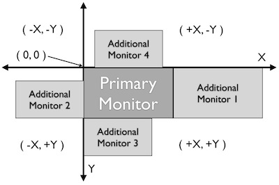

---

---

# Screen

*class* `Screen`是一个物理监视器的表示，其中实现了捕获过程（从屏幕截图中抓取一个矩形，用于进一步处理查找操作）。对于多监视器环境，它包含映射到相关监视器的功能。

由于`Screen`扩展了*class* `Region`，所以*class* `Region`的所有方法都可以与`Screen`对象一起使用。

特别感兴趣的可能是`region`的方法调用的分组：在多监视器环境中：将其用于默认/主屏幕之外的其他屏幕，默认情况下在主屏幕上具有此功能。

> 请注意，使用整个屏幕进行查找操作可能会影响性能。因此，如果可能，可以使用`setROI()`或将查找操作限制为较小的区域对象（例如`reg.find()`），以加快处理速度。

## Screen: Setting, Getting Attributes and Information

*class* `Screen`

- `Screen`([*id*])

  创建一个新Screen对象

  参数: **id**–一个整数，指示多监视器环境中的哪个监视器。

  返回：一个新的Screen对象。

  它会创建一个新的screen对象，如果省略了id，则该对象表示默认/主监视器（其id为0）。数字1及以上表示脚本运行时可用的其他监控器。使用不代表现有监控器的数字将导致脚本停止并出现错误。因此，您可以使用`getNumberScreens()`或异常处理来避免这种情况。

  > 注意：如果要在不创建新屏幕对象的情况下访问默认/主监视器（`Screen(0)`），请使用常引用`SCREEN`，它在脚本启动时创建：`SCREEN=Screen(0)`。

- `getNumberScreens`()

  获取脚本运行时多监视器环境中的屏幕数

- `getBounds`()

  获取屏幕对象表示的监视器的尺寸。返回：矩形对象矩形的宽度和高度表示屏幕对象表示的显示器尺寸。这些属性是从操作系统获得的。不能使用Sikuli脚本修改它们。

## Screen as (Default) Region

通常所有Regin方法都用作`reg.find(PS)`，其中reg是Region对象（或`Screen`或匹配对象）。如果写为`find(PS)`，它将在默认屏幕上起作用，在这种情况下，默认屏幕是隐式区域（映射到常量引用`SCREEN`）。在多监视器环境中，这是主监视器（使用常量引用`SCREEN`，随时访问它），通常是`Screen(0)`，但可能是另一个`Screen()`对象，具体取决于您的平台。

因此，这是一个方便的特性，可以被视为python构造“`with object`“的隐式使用。

另一方面，由于搜索耗时，这可能会降低处理速度。所以要加快处理速度，说区域。`find()`将搜索限制为指定的矩形。另一种可能是使用`setROI()`将对所有后续查找操作的搜索限制在比整个屏幕更小的区域。如果区域明显小于整个屏幕，这将加快处理速度。

## Capturing

`Capturing`是一项功能，它允许从屏幕截图中抓取一个矩形，保存下来供以后使用。每次启动捕获时，都会拍摄一个新的屏幕截图。

有两个不同的版本：

- `Screen.capture()`将所选矩形的内容保存在一个文件中，并返回其文件名，

- `Screen.selectRegion()`只返回选定矩形的位置和尺寸。

这两个功能都可以通过工具栏中的按钮在IDE中使用。

*class* `Screen`

- `capture`([*region | rectangle | text*])

- `capture`(*x*, *y*, *w*, *h*)

  **Parameters**: 

  - **region** – 一个存在的region 对象.

  - **rectangle** – 现有矩形对象（例如，作为另一个region方法的返回值）。
  - **text** – 文本以交互模式显示在屏幕中间。
  - **x** – 要捕获的矩形的x位置
  - **y** – 要捕获的矩形的y位置
  - **w** – 要捕获的矩形的宽度
  - **h** – 要捕获的矩形的高度

  **Returns**: 保存捕获图像的文件路径。在交互模式下，用户可以取消捕获，在这种情况下返回*None*。

  **Interactive Mode:** 该脚本进入屏幕捕获模式，就像在IDE中单击按钮时一样，使用户能够捕获屏幕上的矩形。如果没有给出*文本*，则显示默认的“在屏幕上选择区域”。如果指定了文本以外的任何参数，`capture()`会自动捕获屏幕的给定矩形。在任何情况下，都会拍摄一个新的屏幕截图，所选矩形的内容会保存在一个临时文件中。将返回文件名，稍后可以在脚本中用作对该图像的引用。它可以直接用于允许参数PS的情况（例如，`[Region.find()`]，[`Region.click()`], ...).

- `selectRegion`([*text*])

  以交互方式在屏幕上选择一个区域

  Parameters: 

  - **text** – 显示在屏幕中部的文本。

  Returns: 新`Region`对象或者如果用户取消捕获过程则为*None*。

  **text**在屏幕中间显示大约2秒。如果省略**text**，则显示默认的“在屏幕上选择区域”。进入交互式捕获模式，允许用户以与使用IDE中的选择工具相同的方式选择区域。*注意：您应该检查结果，因为用户可能会取消捕获。*

## Multi-Monitor Environments

如果有多个监视器可用，Sikuli可以管理区域并单击这些监视器上的点。

底部是坐标系（上图），用于定位主监视器，其左上角位于（0,0），x方向向右延伸，y方向向屏幕下边界延伸。附加监视器的位置可以在操作系统中配置为位于主监视器两侧，具有不同的位置和大小。因此，主屏幕左侧的监视器将具有负x值的像素，上方的监视器将具有负y值（左侧和上方的x和y均为负）。

在脚本开始时，Sikuli从操作系统获取相关信息，并创建相应的Screen对象，这些对象的ID（第一个或主监视器为0，其他监视器为1或更高，最大屏幕数小于屏幕数），并且知道矩形，它们覆盖在坐标系中。这些信息对于脚本是只读的。

这些预定义的屏幕对象可以通过`Screen(0)`、`Screen(1)`、...和通常用于创建自己的Screen对象。在映射到主监视器的默认区域上使用区域方法的可能性通过恒定参考屏幕实现。此概念仅适用于主监视器。

如何获取相关信息：

- `getNumberScreens()`返回可用屏幕的数量。

- `getBounds()`返回默认/主监视器覆盖的矩形。

- 屏幕`getBounds()`返回使用`screen(id)`创建的`screen`对象所覆盖的矩形。

请注意：系统设置中的更改只有在IDE启动时才能被识别。

Windows：第一个基于硬件映射的显示器（例如笔记本电脑显示器）将始终显示为`Screen(0)`。在Windows设置中，可以将任务栏放在其中一个辅助监视器上，从而使其成为获取基本坐标（0,0）的主监视器。其他可用监视器将根据您的设置进行映射。但是Sikuli内部映射没有改变，因此主监视器可能是任何`Screen()`对象。Sikuli会注意到这一点，并将屏幕始终映射到主监视器（具有（0,0）坐标的监视器）。例如，你有一台带有外部显示器的笔记本电脑，它显示任务栏（是主显示器）：

- `SCREEN` 映射到 `Screen(1)`
- `Screen(0)` 这是你的笔记本电脑显示器

Mac：带有系统菜单栏的显示器始终为`Screen(0)`，并映射到默认`SCREEN`。

Linux（正在建设中）

`Screen`对象的矩形始终与使用`Screen(id)`创建的监视器相同。使用`Region.setROI()`限制查找操作的感兴趣区域对`Screen`对象的基本矩形没有影响。

另一方面，区域对象和位置对象可以定位在坐标系中的任何位置。仅当必须执行查找操作或单击操作时，对象矩形或点必须位于现有监视器的矩形内（基本上由`Screen(0)`、`Screen(1)`和…重新显示）。当这个条件得到满足时，一切都会按照预期工作，并从单个监控系统中得知。

在发现和采取行动时，有以下例外：

- 指向外部：点击点位于任何监视器矩形的外部。点击点将根据相对位置映射到主监视器的边缘或角落：
  - 如果其x或y值在相应边（右、左、上、下）i的范围内，则为边
  - 对于角，如果x和y超出任何边的任何范围（左/上->左上角，…）

- 区域外部：区域完全在任何监视器之外
  - 单击操作的处理方式与指向外部的方式相同
  - 查找操作总是会失败

- 区域部分位于外部：区域部分位于监视器外部，但不与另一个监视器重叠
  - 单击操作的处理方式与指向外部的方式相同
  - 查找操作将仅在监视器范围内的区域部分执行，不包括监视器外的区域。

- 跨监视器的区域：一个区域跨多个监视器：
  - 单击操作的处理方式与指向外部的方式相同
  - 查找操作将限制在监视器边界内id较小的区域。

交互式捕获（要求用户通过`Screen.capture()`或`Screen.selectRegion()`选择图像或矩形）将自动限制在启动它的监视器上。

使用矩形或区域（即`Screen.capture(region|rectangle)`）的脚本捕获将相应地进行处理：

- 外部区域：未捕获图像，未返回图像

- 部分外部区域：返回的图像将仅覆盖显示器内部的部分

- 监视器区域：返回的图像将仅覆盖监视器内部id最小的部分。

根据您对显示器配置的了解，您现在可以使用例如`Region.hover()`与`Region.setShowActions(True)`来开始一些进一步的评估，高亮显示 `Region.highlight()`。